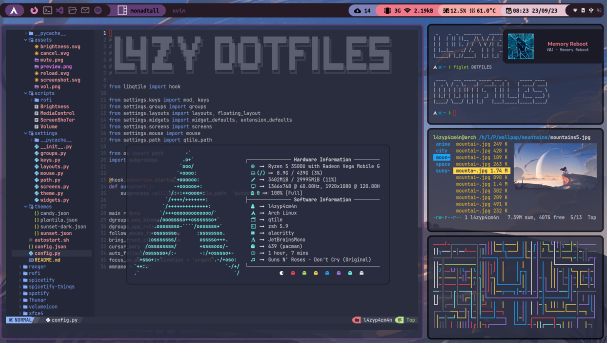

# L4ZY DOTFILES




## requirements

## autostart file exec permission 
```sh
chmod +x .config/qtile/autostart.sh 
```

## pacman things
``` sh
sudo pacman -S alacritty code firefox rofi which nitrogen pulseaudio pavucontrol pamixer arandr udiskie ntfs-3g network-manager-applet volumeicon cbatticon xorg-xinit base-devel mesa git curl thunar ranger glib2 gvfs lxappearance geeqie vlc brightnessctl pacman-contrib python-psutil python-pip neofetch htop lsd bat playerctl xclip papirus-icon-theme maim ueberzug dunst libnotify calcurse figlet ttf-jetbrains-mono xdotool nvim
```

## yay 
install yay
```sh
git clone https://aur.archlinux.org/yay.git && cd yay && makepkg -si
```
install the yay things
```sh
yay -S qtile-extras-git picom-ftlabs-git ttf-ubuntu-mono-nerd ttf-meslo-nerd ttf-cascadia-code-nerd material-gtk-theme-git material-icon-theme-git unimatrix-git pipes.sh gotop cava-git shell-color-scripts tty-clock 
```

## zsh 
```sh
sh -c "$(curl -fsSL https://raw.github.com/ohmyzsh/ohmyzsh/master/tools/install.sh)"
```
```sh
yay -S --noconfirm zsh-theme-powerlevel10k-git
```
```sh
echo 'source /usr/share/zsh-theme-powerlevel10k/powerlevel10k.zsh-theme' >>~/.zshrc
```
```sh
git clone https://github.com/zsh-users/zsh-syntax-highlighting.git ${ZSH_CUSTOM:-~/.oh-my-zsh/custom}/plugins/zsh-syntax-highlighting
```
```sh
git clone https://github.com/zsh-users/zsh-autosuggestions ${ZSH_CUSTOM:-~/.oh-my-zsh/custom}/plugins/zsh-autosuggestions
```
```sh
nano ~/.zshrc
```
copy this on your zshrc
```sh
plugins=(git zsh-autosuggestions zsh-syntax-highlighting)
alias ls="lsd"
alias cat="bat"
colorscript -e panes 
```

## grub 
```sh 
git clone https://github.com/sandesh236/sleek--themes
```
```sh
cd sleek--themes/Sleek\ theme-dark
```
```sh
sudo ./install.sh
```

## lightdm 
```sh
sudo pacman -S lightdm-webkit2-greeter
```
```sh
sudo nano /etc/lightdm/lightdm.conf
```
copy this on your lightdm.conf
```sh
greeter-session=lightdm-webkit2-greeter
```
litarvan theme
```sh
sudo pacman -S lightdm-webkit-theme-litarvan
```
```sh
sudo nano /etc/lightdm/lightdm-webkit2-greeter.conf
```
add this to your lightdm-webkit2-greeter.conf
```sh
webkit_theme = litarvan
```

## rofi theme
```sh
sudo cp .config/qtile/scripts/rofi/rofi-theme/minimal.rasi /usr/share/rofi/themes/
```
```sh
sudo cp .config/qtile/scripts/rofi/rofi-theme/material.rasi /usr/share/rofi/themes/
```
```sh
rofi-theme-selector
```

## fonts for rofi power menu
```sh
sudo cp ~/.config/fonts-for-rofi/GrapeNuts-Regular.ttf /usr/share/fonts/TTF
```
```sh
sudo cp ~/.config/fonts-for-rofi/Icomoon-Feather.ttf /usr/share/fonts/TTF
```
```sh
sudo cp ~/.config/fonts-for-rofi/Iosevka-Nerd-Font-Complete.ttf /usr/share/fonts/TTF
```
```sh
sudo cp ~/.config/fonts-for-rofi/JetBrains-Mono-Nerd-Font-Complete.ttf /usr/share/fonts/TTF
```

## spotify with spicetify 
```sh
yay -S spotify
```
```sh
yay -S spicetify-cli
```
```sh
sudo chmod a+wr /opt/spotify
```
```sh
sudo chmod a+wr /opt/spotify/Apps -R
```
```sh
spicetify backup apply
```
if you can't find pref_file do this
```sh
cd ~
```
```sh
find | grep "spotify/prefs$"
```
then apply the path on .config/spicetify/config-xpui.ini
you have to enter spotify at least 1 time to spawn the folder


## nvim
for my nvim config y use nvchad
```sh
 git clone https://github.com/NvChad/NvChad ~/.config/nvim --depth 1 && nvim
```

# Theming 

## qtile 
the aviable temes are in .config/qtile/themes
you can change the system theme in .config/qtile/config.json 
```sh
nvim .config/qtile/config.json
```

## power menu 
the aviable themes are in .config/qtile/scripts/rofi/
you can change the power menu script theme on .config/qtile/scripts/rofi/powermenu.sh
```sh
nvim .config/qtile/scripts/rofi/powermenu.sh
```
the aviable colors are in .config/qtile/scripts/rofi/colors
you can change it on .config/qtile/scripts/rofi/shared/colors.rasi
```sh
nvim .config/qtile/scripts/rofi/shared/colors.rasi
```

## alacritty 
the aviable themes are in .config/alacritty 
you can change the teme on .config/alacritty/alacritty.yml
```sh
nvim .config/alacritty.yml
```

## spicetify 
you can change the teme with spicetify config current_theme THEME_NAME
i put my favorite temes on spicetify-things you can copy it into your spicetify temes
example
```sh
spicetify config current_theme text color_scheme rosepine
```
```sh
spicetify apply
```
more info abut the temes on 
https://github.com/spicetify/spicetify-themes/tree/master
